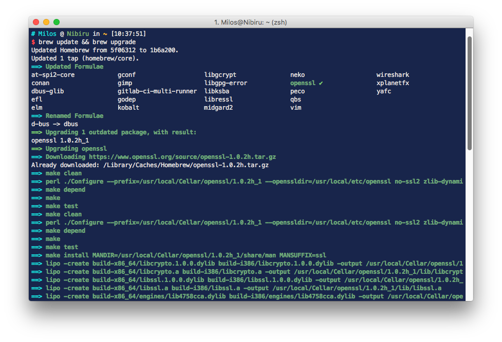

# Pandora for iTerm2

##Installation Instructions##
* Launch iTerm 2
* Go to Preferences > Profiles
* Navigate to Colors tab
* Click on Color Presets
* Click on Import
* Select the Pandora.itermcolors
* Click on Load Presets and choose a Pandora scheme